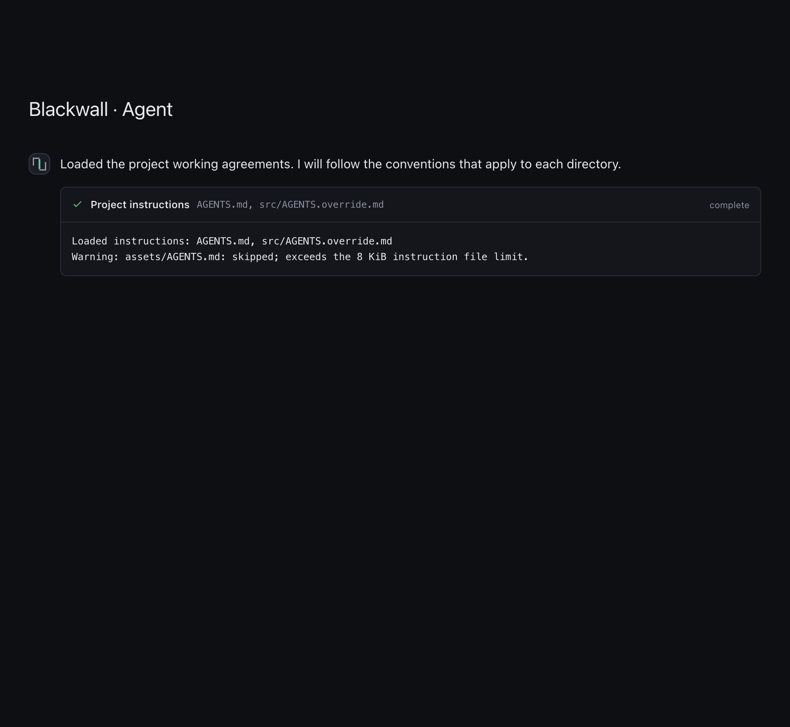

# Project instructions

CLI tasks and desktop **Agent** conversations load working agreements through the same core
runtime. Plain desktop Chat does not have a project and does not discover instruction files.

## Discovery and precedence

Each agent turn starts with:

1. User guidance in the application data directory (`~/.blackwall/` by default). The CLI's
   `BLACKWALL_DATA_DIR` also selects this user-guidance boundary. Acceptance desktop builds use
   their isolated application data directory.
2. Guidance in the selected workspace root. Discovery never walks above that root, including
   when the selected folder is a subdirectory of a larger repository.
3. Nested guidance from the root toward the directory targeted by `read_file`, `write_file`,
   `list_files`, or `search_files`. For file targets, discovery stops at the parent directory;
   for directory targets, it includes the target directory. It does not recursively scan sibling
   folders, interpret shell commands, or automatically discover every descendant of a search.

At each directory, a present `AGENTS.override.md` replaces `AGENTS.md`. This includes an empty,
malformed, oversized, or unreadable override: such a file never falls back to `AGENTS.md`.
Missing files are normal. Empty files contribute no text. Other skipped files produce warnings.

User guidance applies to the whole workspace. Workspace-root guidance supersedes user guidance,
and deeper guidance supersedes broader guidance **within that deeper directory and descendants**.
Guidance discovered in one sibling does not apply to another. Read-only child investigators
inherit their parent's discovered guidance and load instructions for their own file-tool targets,
using the same bounds and retaining their restricted tool set. Child discovery reports appear
separately in the desktop activity list. Discovery caches visited directories
for the current turn and starts fresh on the next turn, so edits take effect then.

When a batch of file tools discovers new guidance, writes in that batch are deferred. The model
receives the scoped guidance and must propose the edit again before review.

## Boundaries and provenance

Project reads use the selected workspace's directory capability. User guidance uses a separate,
explicit application-data-directory capability. Absolute paths, parent traversal, `.git` targets,
and symlinks escaping either boundary cannot contribute guidance. Guidance files themselves must
be regular files; file symlinks are skipped even when their target stays inside the boundary.

Each file is limited to **8 KiB** of UTF-8 text without NUL bytes; the combined file content is
limited to **32 KiB** per turn. Files that exceed either budget are skipped, not truncated. Discovery
also limits targets to 32 directory components and visits at most 128 directories, including the
user and workspace roots. Discovery work runs off the async executor with a ten-second wait limit.
Warnings are bounded and do not include instruction contents.

The CLI prints contributing file paths and warnings. Desktop Agent messages show a
**Project instructions** activity entry; expand it to inspect the source list and warnings.
Provenance contains filenames, not guidance bodies. User files are labeled `User guidance:`;
project files are labeled relative to the workspace.

The screenshot uses offline fixture data rendered by the desktop message component.

Guidance supplies conventions only. It cannot enable web tools, widen file access, approve writes
or shell commands, or change the registered tool set. The runtime still checks tool availability,
workspace boundaries, and approval decisions independently of model output.

## Creating guidance with /init

Type `/init` in interactive `bw` chat or send it as a desktop Agent message. `bw run /init` also
works. Blackwall proposes a starter `AGENTS.md` through the existing file-approval flow, showing
its full diff before writing. No model request is needed to generate this proposal. The template
points to the project's documented commands instead of inventing project-specific commands.

Allow the proposal to create the file, then customize its build commands and conventions. Denying
or stopping the proposal leaves the project unchanged. Existing `AGENTS.md` or
`AGENTS.override.md` files are preserved; `/init` does not append to or replace them. Guidance that
appears while approval is pending also prevents creation. Invalid existing files produce a safe
error rather than being overwritten.
