# Development and production workflow

`partial` is the default, long-lived integration branch. `main` is production.
Every change enters through a pull request; a release batches the work accumulated on `partial`.

```mermaid
flowchart LR
  I[Issue in version milestone] --> F[Feature branch from partial]
  F --> C[Pull request and CI]
  C --> P[partial]
  P --> R[Release notes, version, acceptance, milestone]
  R --> G[partial to main PR and both macOS builds]
  G --> M[main merge commit]
  M --> V[Passing production CI]
  V --> B[Signed builds and artifact verification]
  B --> S[Versioned release and updater feed]
  S --> Y[main to partial sync PR]
  Y --> P
```



## Start and track a change

1. Create a bug or feature issue. Assign it to the intended `v<version>` milestone and apply
   relevant type, priority, or dependency labels. The milestone is the release batch's task list.
2. Branch from the latest integration branch:

   ```sh
   git fetch origin
   git switch -c feat/my-change origin/partial
   ```

3. Make a focused change and use Conventional Commits. Update the appropriate changelog section
   for user-visible behavior. Run the checks described in [CONTRIBUTING.md](../CONTRIBUTING.md).
4. Open a PR targeting `partial`. Link the issue with `Closes #123`, include verification and any
   UI screenshots, and assign the same milestone. Because `partial` is the default branch,
   merging the development PR closes linked issues and updates the milestone's progress.
5. CI requires Rust formatting/lint/tests, Linux relay tests and container acceptance,
   dependency policy, dependency vulnerability review, UI check/test/build, and release-policy
   tests. `Quality gate` fails when an applicable job fails, is cancelled, or unexpectedly skips.
   `Production promotion` checks the branch contract. Both statuses are required.
6. Resolve review conversations and use a Conventional Commit PR title. After reviewing the
   current code, apply `ready-to-merge` to enter the automatic queue described below. Manual
   checked squash merges remain available. Delete the feature branch after merging.

Both long-lived branches prohibit direct pushes, force pushes, deletion, and administrator bypass.
The repository currently has one collaborator, so mandatory external reviews are set to zero.
Code ownership routes reviews to the maintainer. Once another reviewer joins, run
`npm run repo:configure -- --apply --reviews=1` to require fresh approval and code-owner review.

## Automatically merge reviewed development PRs

Apply `ready-to-merge` after reviewing a feature PR into `partial`. A maintainer with write,
maintain, or admin access must apply the label. The queue records that PR's exact head commit
in its **Merge queue** check. Only non-draft branches in this repository are eligible; fork
PRs, production promotions, and `main`/`partial` sync branches use the manual process.

The oldest label request goes first. Each cycle updates or merges only that PR, then exits:

1. If the branch is behind, merge the latest `partial` into it without rebasing or force pushes.
2. Preserve approval only for that exact base-merge commit and wait for fresh PR CI.
3. Require successful **Quality gate** and **Production promotion** checks from the latest
   CI and Branch policy PR runs. Pending, cancelled, skipped, stale, or failed required checks
   never qualify. Re-running CI makes the queue wait for that newer attempt.
4. Squash merge the reviewed head through GitHub's normal protected-branch API. GitHub still
   enforces reviews, resolved conversations, up-to-date checks, and all other rules. The queue
   grants no administrator bypass, never promotes to `main`, and never deletes a branch.

The **Partial merge queue** workflow wakes on labels, PR changes, completed CI, and `partial`
pushes. A five-minute schedule and **Run workflow** provide recovery for missed wakeups; GitHub
may delay scheduled runs. Queue order is the latest label time, with the PR number as a tie-breaker.

If the first PR conflicts, fails checks, becomes a draft, or receives a new source push, the
queue pauses behind it. Inspect the **Merge queue** check and workflow summary. For failed CI,
fix the problem or rerun transient failures; after code changes, review the new head and remove
then reapply `ready-to-merge`. Do the same after resolving conflicts. Remove the label to
withdraw the PR and let the next one proceed. Reapplying it places the PR at the back of the queue.
Do not enable GitHub auto-merge separately for queued PRs; this workflow owns sequencing.

### One-time credential setup

Create a dedicated fine-grained personal access token with only `AlecBhamani1/Blackwall` selected.
Grant **Contents**, **Pull requests**, and **Workflows** read/write access; Metadata read is
included. Add it under repository **Settings → Secrets and variables → Actions** as the secret
`MERGE_QUEUE_TOKEN`. Choose an expiry and rotate the secret before it expires. Do not reuse a
general-purpose CLI token or put credentials in Git, PRs, or workflow logs.

The ordinary `GITHUB_TOKEN` records queue checks and reads repository state. The dedicated token
is used only by the update and merge API calls, so those actions trigger normal CI and the
subsequent `partial` push workflows without a manual workflow-approval step. See GitHub's
[token-trigger behavior](https://docs.github.com/en/actions/concepts/security/github_token).
Only trusted code from `partial` executes in the privileged queue workflow; it never checks out
or executes a PR's code. No token has a branch-protection bypass. Without the secret, queued PRs
pause with a setup instruction instead of attempting an update or merge.

The active **Partial merge queue triggers** Actions policy explicitly allows this workflow's
five triggers, including `pull_request_target`. It targets only `.github/workflows/merge-queue.yml`,
so the queue continues working when GitHub enforces its public-repository event default on
November 2, 2026. `npm run repo:configure -- --apply` creates or updates this policy while
preserving unrelated policies. See GitHub's [event policy guidance](https://docs.github.com/en/actions/reference/security/securely-using-pull_request_target#default-policy-for-pull_request_target).

Start each new task from `origin/partial`. Completed feature branches are historical snapshots;
they do not need continuous updates. The queue updates open PRs, not local worktrees.

## Promote a release batch

1. Check the version milestone: intended issues are complete and deferred work is explicitly
   moved to a later milestone. Finish applicable [native acceptance checks](NATIVE_ACCEPTANCE.md).
   Record evidence and remaining limitations accurately; automated builds cannot establish
   physical-device acceptance or Apple signing/notarization.
2. Start a release-preparation branch from `origin/partial` and run:

   ```sh
   npm run release:prepare -- 0.1.4
   ```

   This updates `.github/release.json` and creates `docs/releases/0.1.4.md` using the existing
   release format: `# Blackwall <version>`, `Changes`, `Downloads`, and `Acceptance status`.
   Fill every placeholder, link the milestone URL, and update `CHANGELOG.md`.
   Merge the preparation PR into `partial` through the normal checks.
3. Ensure the previous production version and its compatibility feed have finished publishing.
   Open a PR with head `partial` and base `main`, title `chore(release): publish v0.1.4`, label
   `release`, and milestone `v0.1.4`. Complete the three production checklist items from the PR
   template. Checking the publication item and merging authorizes automatic publication.
4. The production gate requires this repository's `partial` branch, a newer stable version,
   complete notes, the matching milestone, explicit checked acceptance, and the latest `main`
   commit in `partial`'s history. Both Apple Silicon and Intel desktop builds must also pass.
   Merge this PR with a **merge commit**. Production rules prohibit squash/rebase promotions,
   which would sever shared history and make the next batch difficult to compare.
5. The main push runs CI. Its successful completion automatically starts the signed release
   workflow for that exact commit. All installers, updater archives, signatures, and manifest
   entries must pass verification before the version is published as Latest. The original
   `main/latest.json` compatibility feed advances afterward. See [UPDATES.md](UPDATES.md).
6. Verify the downloads and updater. Close the version milestone once publication and release
   verification are complete, then create the next milestone. Release notes and the release
   page record the source commit; the milestone records the included issues and PRs.
7. Bring the production merge commit back into integration through a sync PR:

   ```sh
   gh pr create --base partial --head main --title 'chore: sync production into partial' \
     --body 'Preserve production merge ancestry before the next release batch.'
   ```

   After CI passes, merge that PR with **Create a merge commit**. Never squash this sync PR,
   delete `partial`, or reset it. Development can continue while the signed build runs, but a
   subsequent production promotion must wait for the preceding version and feed to publish.

## Urgent fixes, failed releases, and recovery

For an urgent fix, pause unrelated merges into `partial`, land a focused fix through its checked
PR, and promote a patch version through the same process. This batching model promotes everything
already in `partial`; keep unfinished functionality behind safe defaults or feature flags.

A failed build leaves a draft and preserves the existing updater feed. Re-run failed jobs.
If publication succeeded but the compatibility feed failed, retry the publish job or manually
dispatch **Publish versioned release** from `main` with acceptance confirmed. A full retry now
skips builds of an already-published version and verifies/repairs its feed. Never replace published
files or move a version tag. For a bad application release, revert the affected change through a
PR into `partial` and publish a **new, higher patch version**; the updater refuses downgrades.

## GitHub setup and bootstrap

Repository policy is reproducible and dry-run by default:

```sh
npm run repo:configure
npm run repo:configure -- --apply
```

The script creates `partial` at `main` if absent, installs explicit branch rules without bypasses,
sets `partial` as default, configures merge methods, adds tracking labels, and enables secret
scanning/push protection, Dependabot security fixes, and private vulnerability reporting.
Version tags matching `v*` are protected against updates and deletion.
Existing unrelated rulesets remain in place. Weekly dependency PRs target `partial` and undergo
the same CI gates. Routine patch/minor updates are grouped separately from breaking upgrades;
known pre-1.0 Rust dependencies only group patch updates because their minor upgrades can break
APIs. Major upgrades use separate PRs, with Vitest and its coverage package updated together.
TypeScript stays on version 6 until `svelte-check` declares support for the next major version;
remove the Dependabot `>=7` hold only alongside a verified tooling migration.
Feature branches are deleted explicitly so a release merge cannot delete
the long-lived integration branch.

The setup PR first lands in `partial`; it does not publish an application version. The committed
release baseline is the existing `0.1.3` release. The first promotion chooses `0.1.4` or higher
and installs this automation on `main`. The production gate reads the existing versioned notes
as its baseline during that one-time migration. No acceptance checklist is pre-approved.
