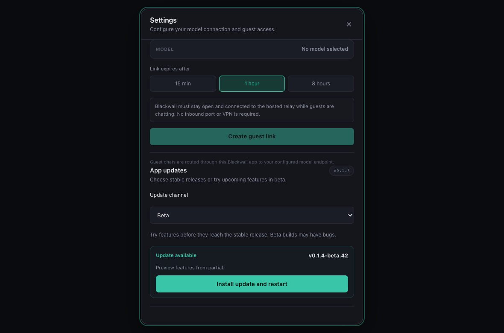

# App updates

Each approved version has its own GitHub Release, such as `v0.1.3`, with version-specific downloads
and release notes. The [latest release](https://github.com/AlecBhamani1/Blackwall/releases/latest)
is the download destination. The old `main` release is retained as a compatibility feed for apps
that already check `https://github.com/AlecBhamani1/Blackwall/releases/download/main/latest.json`.
Do not delete that release or move its tag. Its feed points to the latest approved version's files.

The desktop app checks at startup and exposes a manual check under **Settings → App updates**.
An available update is downloaded only after the user selects **Install update and restart**.

## Testing partial with Beta

Open **Settings → App updates → Update channel**, select **Beta**, then choose
**Install update and restart** when a build is available. The choice is saved across restarts.
Stable is the default; a manually installed beta defaults to Beta unless a channel was already saved.
Select **Stable** to return to the latest production release, even when its version is older than
an installed beta. Changing channels checks immediately; it never installs automatically.

After CI succeeds for a trusted push to `partial`, **Publish beta release** creates a commit-pinned
prerelease with signed macOS (Apple Silicon and Intel), Windows x64, and Linux x86-64/ARM64 builds. It reuses the production signing secrets.
Versions use the next patch above `.github/release.json`, followed by `-beta.<workflow run number>`;
for a `0.1.4` production plan, a preview is `0.1.5-beta.42`. Each workflow retry retains its version.
Beta notes include the Unreleased changelog and source commit. Beta does not require production
acceptance and may contain unfinished features or bugs.

The workflow verifies every platform's downloads and signatures before publishing and advancing
`beta/latest.json`. It creates the `beta` feed release on first publication, keeps versioned files
immutable, and never changes GitHub Latest or `main/latest.json`. A failed upload is repaired by
rerunning the failed job; published builds are not rebuilt. A newer published beta blocks an older
retry from moving the feed backward, including when a feed upload was interrupted.

Once this change merges into `partial`, passing push CI starts the first beta build. To retry
manually, run **Publish beta release** from **partial**; successful push CI for that exact commit
is still required. Existing apps without the channel selector need one manual installation of a
beta download (or a stable release containing this selector). Download a numbered prerelease's
installer from GitHub Releases; the `beta` release itself hosts only the updater feed.

Beta and stable replace the same application and use the same local data. An older stable build
may not understand data formats introduced by a future beta; back up local data before testing
versions that change storage formats.

## Platform updater bundles

| Updater platform | Signed update bundle | Other downloads |
| --- | --- | --- |
| `darwin-aarch64`, `darwin-x86_64` | `.app.tar.gz` | `.dmg` |
| `windows-x86_64` | NSIS `x64-setup.exe` | — |
| `linux-x86_64`, `linux-aarch64` | `.AppImage` | `.deb` (updates in place when Tauri signs it) |

Windows builds use NSIS only: WiX MSI cannot represent beta pre-release versions. Linux builds run on
Ubuntu 22.04 runners so the AppImage works on 22.04 and newer distributions. A `.deb` installation is
updated by the in-app updater only when the feed carries a signed `linux-<arch>-deb` entry;
otherwise reinstall the newer package or use the AppImage.

## Publishing an approved version

`partial` is integration and `main` is production. A checked `partial` → `main` promotion
records acceptance approval **before** production changes. Every production promotion must
increment `.github/release.json`, commit matching release notes, and belong to its version
milestone. Follow [the repository workflow](REPOSITORY_WORKFLOW.md) for the full checklist.

1. Complete applicable [native and distribution acceptance checks](NATIVE_ACCEPTANCE.md),
   recording evidence and remaining limitations in the release notes. Start a preparation branch
   from `partial` and use `npm run release:prepare -- 0.1.4` to create the next release plan.
2. Merge the preparation work into `partial`, then open a `partial` → `main` PR. Assign its
   `v<version>` milestone and complete the production checklist. The gate requires meaningful
   notes, a newer version, current main ancestry, and the previous release's completed feed.
   CI also checks desktop builds for both architectures before merging.
3. Merge the promotion with a merge commit. After CI succeeds for this exact main push,
   **Publish versioned release** automatically checks out that production SHA and creates a
   commit-pinned draft. It builds Apple Silicon and Intel installers and signed updater archives.
4. The final job verifies all six files against their GitHub SHA-256 digests, verifies both updater
   entries reference those archives and match their signature files, then publishes `v<version>`
   as Latest. It updates the old `main/latest.json` feed only after publishing the complete release.
5. Verify downloads and the app's update check, close the milestone, and merge `main` back into
   `partial` with a checked sync PR and merge commit before the next promotion.

The workflow retains the existing release title, release-note sections, download filenames,
signed updater assets, and compatibility feed. It overrides the Tauri application version using
the committed release plan and records the source commit on each release. Versions compare
numerically; `0.1.10` follows `0.1.9`. GitHub asset digest checks protect download integrity;
matching updater metadata to signature files does not replace Tauri's cryptographic signature
verification during installation.

Manual dispatch is reserved for recovery: select **main** and confirm the existing acceptance
approval. The committed version is used, so a dispatch cannot silently choose a different version.

## Failure and retry

A failed build leaves a draft and the existing updater feed untouched. Use **Re-run failed jobs**
to finish it. The two builds run sequentially because Tauri merges their updater entries into one
manifest. Release runs are also serialized so an older run cannot overwrite a newer update feed.

Publishing the release and replacing the compatibility feed are separate GitHub operations. If the
feed upload fails after publication, re-run the failed publish job. It validates the published
assets again and repairs the feed without rebuilding or overwriting the versioned release files.
A completed publication can also be retried safely when the feed already matches it. The workflow
refuses to downgrade the feed. A full workflow retry skips rebuilding an already-published version and runs publication verification/feed recovery only.

GitHub replaces an uploaded `latest.json` by deleting and recreating that single asset; there can
be a brief unavailable-feed interval. An interrupted replacement is repairable by rerunning the
publish job. Already-installed apps retain their installed version if an update check fails.

## Signing credentials

The repository must have the `TAURI_SIGNING_PRIVATE_KEY` and
`TAURI_SIGNING_PRIVATE_KEY_PASSWORD` Actions secrets. The matching public key is embedded in
`src/app/tauri.conf.json`. The private key is stored only on the maintainer's machine at
`~/.tauri/blackwall.key`, with its password in macOS Keychain under
`com.blackwall.updater-signing`; keep an encrypted backup. Losing either means existing installs
cannot trust updates signed with a replacement key.

## Existing main-channel builds

Version 0.1.3 was originally published on September 24, 2026. Its versioned release reuses the
original application files and signatures. The compatibility release and its older assets remain
available so existing download links and installed apps continue to work.

Builds predating the updater need one manual installation of an updater-enabled release. Later
approved versions can then be installed from inside Blackwall.
